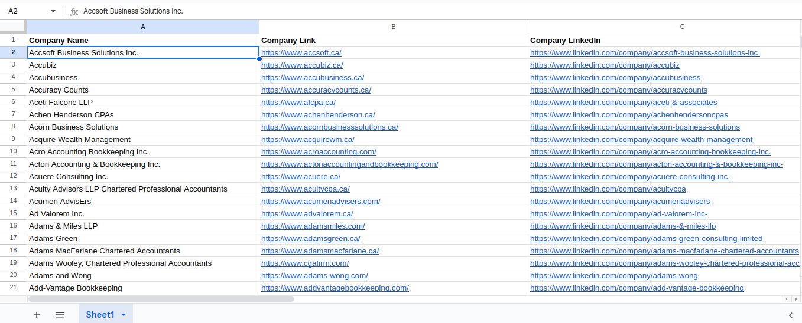
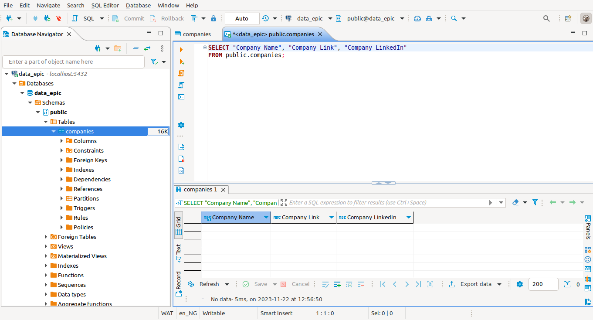

# Project 5 (Postgres Database Integration)

## Overview
Project 5 revolves entirely around transferring data from a spreadsheet to a database. The dataset comprises publicly available scraped information from the [lusha](lusha.com) website, specifically focusing on companies in Canada.

The provided script in `main.py` defines a utility class, `DBUtility`, for extracting data from a Google Sheet document, processes and validates the data while interacting with a PostgreSQL database for ingestion. 

The `DBUtility` class contains the following methods:

- `extract_from_google_sheet`: Extracts `company` data from a public Google Sheet document.
- `connect_to_database`: Connects to a PostgreSQL database.
- `create_postgres_table`: Creates a PostgreSQL table named `companies` with specific columns.
- `insert`: Inserts data into the `companies` table from the extracted DataFrame.
- `table_validation`: Applies CHECK constraints to ensure specific conditions are met within the `companies` table.
- `data_type_validation`:  Applies CHECK to ensure specific data types are met 

### Data source:
[public Google sheet data](https://docs.google.com/spreadsheets/d/1grKWiIQPgqg-KD2rJwRofl3odqsQc-GbLIed7KRPcb8/edit?usp=sharing)

## Technologies used
- Bash
- GCP
- PostgreSQL
- Python   
  *Dependencies used:*
  - pandas: `^2.1.3`
  - gspread: `^5.12.0`
  - gspread-dataframe: `^3.3.1`
  - psycopg2-binary: `^2.9.9`
  - python-dotenv: `^1.0.0`

## Prerequisites
- GCP account with Google sheets & Google Drive API's Enabled
- PotgresSQL Database on localhost 
- Python3.9+ Intepreter
- Poetry `^1.7.1`

## Project build & setup 
___
- **setup development environment:** 
  - `poetry env use python3.9` 
  - `poetry install` 
 

- **Create dedicated database**

  - login to postgres local as root user: `sudo -u postgres psql` or `psql -U postgres`    you will get this prompt: 

             
        psql (12.9 (Ubuntu 12.9-0ubuntu0.20.04.1))
        Type "help" for help.

        postgres=#
        
  - create a new user: `CREATE USER <your user> WITH PASSWORD <'your_password'>;`

  - create new database: `CREATE DATABASE <your_database_name>;`

  - grant user priveleges on new database `GRANT ALL PRIVILEGES ON DATABASE <your_database_name> TO <your_username>;`

 

- **Create and define required env variables in the `.env` file**
  
      SHEET_URL="https://docs.google.com/spreadsheets/d/1grKWiIQPgqg-KD2rJwRofl3odqsQc-GbLIed7KRPcb8/edit?usp=sharing"
      WORKSHEET_NAME="Sheet1"
      CREDENTIALS_PATH=<"your_credentials.json_path">
      DB_USER=<"your_db_username>
      DB_PASSWORD=<"your_db_password>
      DB_NAME=<"your_database_name">
      HOST="localhost"
      PORT="5432"

- **run `main.py` script from entry point with `poetry`**: `poetry run python3.9 main.py` 

### Project Directory structure
      project-5
      .
      ├── credentials.json
      ├── exceptions.py
      ├── main.py
      ├── poetry.lock
      ├── pyproject.toml
      ├── READ2.md
      ├── README.md
      ├── static
      │   └── dbeaver-dev.png
      └── utils.py

- `credentials.json`: Google cloud api keys
- `exceptions.py`: all error exception handling happens here
- `main.py`: main script exists here
- `poetry.lock`: lock file for dependencies (recomended over toml file for installation)
- `pyproject.toml`: poetry project dependencies and meta-data
- `utils.py`: all helper funtions goes here

## Results

<!-- ### for dev purpose only **⚠️**
- BBeaver console sample 
 -->